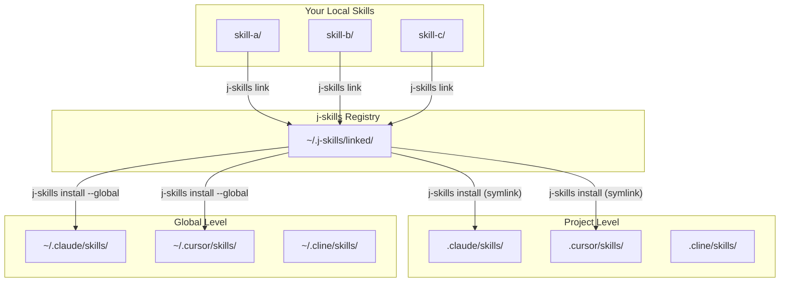

# j-skills

> A unified registry for managing scattered Agent Skills - link once, install everywhere

[中文文档](./README_CN.md)

## The Problem

If you develop Agent Skills, you've probably faced these issues:

- **Scattered Skills**: Your skills are spread across multiple projects
- **Manual Copying**: Installing to different agents requires copying files manually
- **Update Hell**: Updating a skill means re-copying to every environment
- **No Central View**: Hard to see what skills you have and where they're installed

## The Solution

j-skills solves this with a **two-step workflow**:

```
┌─────────────────┐      ┌─────────────────┐      ┌─────────────────┐
│   Your Skills   │      │  j-skills       │      │  35+ Agents     │
│   (scattered)   │ ───► │  Registry       │ ───► │  (everywhere)   │
│                 │ link │  (unified)      │ inst │                 │
└─────────────────┘      └─────────────────┘      └─────────────────┘
```

1. **`j-skills link`** - Register local skills to a central registry
2. **`j-skills install`** - Distribute to any of 35+ agent environments

## Architecture



## How It Works

### Step 1: Link Your Skills

Register your local skill directories to the j-skills registry:

```bash
# Navigate to your skill directory
cd ~/projects/my-awesome-skill

# Link it to the registry
j-skills link

# Now it's in the registry!
j-skills link --list
```

**What happens**: A symlink is created in `~/.j-skills/linked/<skill-name>` pointing to your original skill directory.

### Step 2: Install to Agents

Install registered skills to any supported agent environment:

```bash
# Install to current project
j-skills install my-awesome-skill

# Install globally (available in all projects)
j-skills install my-awesome-skill --global

# Install to specific environments
j-skills install my-awesome-skill --env claude-code,cursor,windsurf
```

**What happens**: Symlinks are created in the target agent's skills directory, pointing to your original skill.

### Step 3: Develop with Hot-Reload

Since everything uses symlinks, your changes are instantly available everywhere:

```bash
# Edit your skill
vim ~/projects/my-awesome-skill/skill.md

# Changes are immediately visible in:
# - .claude/skills/my-awesome-skill/
# - .cursor/skills/my-awesome-skill/
# - All other installed locations!
```

## Why Symlinks?

| Approach | Disk Space | Updates | Management |
|----------|------------|---------|------------|
| Copy files | ❌ Duplicates | ❌ Manual | ❌ Scattered |
| Symlinks | ✅ Zero copy | ✅ Instant | ✅ Centralized |

## Installation

```bash
# Global installation
npm install -g @wangjs-jacky/j-skills

# Or use npx (no installation required)
npx @wangjs-jacky/j-skills <command>
```

## npm Package

This package is published to npm as [`@wangjs-jacky/j-skills`](https://www.npmjs.com/package/@wangjs-jacky/j-skills).

```bash
# View package info
npm info @wangjs-jacky/j-skills
```

## Commands

### `link` - Register Skills

```bash
# Link current directory (must contain skill.md)
j-skills link

# Link specific directory
j-skills link /path/to/skill

# List all linked skills
j-skills link --list

# Unlink a skill
j-skills link --unlink <skill-name>
```

### `install` - Distribute Skills

```bash
# Interactive installation (select environments)
j-skills install <skill-name>

# Install to current project
j-skills install <skill-name>

# Install globally
j-skills install <skill-name> --global

# Install to specific environments
j-skills install <skill-name> --env claude-code,cursor

# Verbose output
j-skills install <skill-name> --verbose
```

### `uninstall` - Remove Skills

```bash
# Interactive uninstallation
j-skills uninstall <skill-name>

# Global uninstallation
j-skills uninstall <skill-name> --global

# Skip confirmation
j-skills uninstall <skill-name> --yes
```

### `list` - View Skills

```bash
# List project-level skills
j-skills list

# List global skills
j-skills list --global

# List all skills
j-skills list --all

# Search skills
j-skills list --search <keyword>

# JSON output
j-skills list --json
```

### `config` - Manage Settings

```bash
# View configuration
j-skills config

# Set default environments
j-skills config set defaultEnvironments '["claude-code","cursor"]'

# Set auto-confirm
j-skills config set autoConfirm true
```

## Supported Agents (35+)

j-skills follows the [Vercel Skills Specification](https://github.com/vercel-labs/skills#available-agents):

| Agent | Project Path | Global Path |
|-------|--------------|-------------|
| Claude Code | `.claude/skills/` | `~/.claude/skills/` |
| Cursor | `.cursor/skills/` | `~/.cursor/skills/` |
| OpenCode | `.agents/skills/` | `~/.config/opencode/skills/` |
| Cline | `.cline/skills/` | `~/.cline/skills/` |
| Continue | `.continue/skills/` | `~/.continue/skills/` |
| Windsurf | `.windsurf/skills/` | `~/.codeium/windsurf/skills/` |
| GitHub Copilot | `.agents/skills/` | `~/.copilot/skills/` |
| Augment | `.augment/skills/` | `~/.augment/skills/` |
| Roo Code | `.roo/skills/` | `~/.roo/skills/` |
| Gemini CLI | `.agents/skills/` | `~/.gemini/skills/` |

<details>
<summary>View All 35+ Agents</summary>

- Amp / Kimi CLI / Replit - `.agents/skills/`
- Antigravity - `.agent/skills/`
- OpenClaw - `skills/`
- CodeBuddy - `.codebuddy/skills/`
- Command Code - `.commandcode/skills/`
- Crush - `.crush/skills/`
- Droid - `.factory/skills/`
- Goose - `.goose/skills/`
- Junie - `.junie/skills/`
- iFlow CLI - `.iflow/skills/`
- Kilo Code - `.kilocode/skills/`
- Kiro CLI - `.kiro/skills/`
- Kode - `.kode/skills/`
- MCPJam - `.mcpjam/skills/`
- Mistral Vibe - `.vibe/skills/`
- Mux - `.mux/skills/`
- OpenHands - `.openhands/skills/`
- Pi - `.pi/skills/`
- Qoder - `.qoder/skills/`
- Qwen Code - `.qwen/skills/`
- Trae - `.trae/skills/`
- Zencoder - `.zencoder/skills/`
- Neovate - `.neovate/skills/`
- Pochi - `.pochi/skills/`
- AdaL - `.adal/skills/`

</details>

## Web GUI

j-skills includes a visual interface for easier management:

```bash
# Start development servers
pnpm dev:all

# Or separately:
pnpm dev:server  # Backend :3001
pnpm dev:web     # Frontend :5173
```

**Features:**
- Visual skill browser
- One-click install/uninstall
- SKILL.md preview
- Source folder monitoring
- Settings management

## Skill Format

Create a `skill.md` file in your skill directory:

```markdown
---
name: my-skill
description: Brief description of what this skill does
---

# My Skill

Detailed instructions for the AI agent...

## Usage

1. First step
2. Second step
```

## Configuration

Config file: `~/.j-skills/config.json`

```json
{
  "defaultEnvironments": ["claude-code", "cursor"],
  "autoConfirm": false
}
```

## Comparison

| Feature | j-skills | Manual Copy | Vercel Skills |
|---------|----------|-------------|---------------|
| Central Registry | ✅ | ❌ | ❌ |
| One-command Install | ✅ | ❌ | ✅ |
| Hot-Reload | ✅ | ❌ | ❌ |
| Multi-environment | ✅ | ❌ | ✅ |
| Visual GUI | ✅ | ❌ | ❌ |
| 35+ Agents | ✅ | - | ✅ |

## License

MIT

## Resources

- [Vercel Skills Specification](https://github.com/vercel-labs/skills)
- [Claude Code Documentation](https://docs.anthropic.com)
- [Agent Skills Directory](https://skills.sh)
