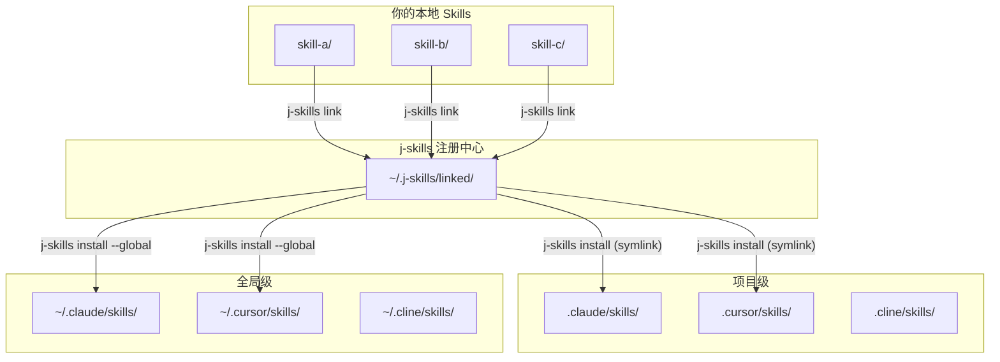

# j-skills

> 统一管理零散 Agent Skills 的注册中心 - 一次 link，到处 install

[English](./README.md)

## 问题背景

如果你开发 Agent Skills，可能遇到过这些问题：

- **技能分散**：你的 skills 散落在多个项目中
- **手动复制**：安装到不同 agent 需要手动复制文件
- **更新地狱**：更新一个 skill 意味着重新复制到每个环境
- **缺乏全局视图**：很难看清你有哪些 skills，以及它们装在哪里

## 解决方案

j-skills 通过**两步工作流**解决这个问题：

```
┌─────────────────┐      ┌─────────────────┐      ┌─────────────────┐
│   你的 Skills    │      │  j-skills       │      │  35+ Agents     │
│   (分散各处)     │ ───► │  注册中心        │ ───► │  (到处都是)      │
│                 │ link │  (统一管理)      │ inst │                 │
└─────────────────┘      └─────────────────┘      └─────────────────┘
```

1. **`j-skills link`** - 将本地 skills 注册到中心注册表
2. **`j-skills install`** - 分发到 35+ 个 agent 环境中的任意一个

## 架构图



## 工作原理

### 第一步：Link 你的 Skills

将本地 skill 目录注册到 j-skills 注册中心：

```bash
# 进入你的 skill 目录
cd ~/projects/my-awesome-skill

# 注册到中心
j-skills link

# 现在它已经在注册中心了！
j-skills link --list
```

**发生了什么**：在 `~/.j-skills/linked/<skill-name>` 创建了一个软链接，指向你的原始 skill 目录。

### 第二步：Install 到 Agents

将注册的 skills 安装到任意支持的环境：

```bash
# 安装到当前项目
j-skills install my-awesome-skill

# 全局安装（所有项目都可用）
j-skills install my-awesome-skill --global

# 安装到指定环境
j-skills install my-awesome-skill --env claude-code,cursor,windsurf
```

**发生了什么**：在目标 agent 的 skills 目录中创建软链接，指向你的原始 skill。

### 第三步：热更新开发

由于全部使用软链接，你的修改会即时同步到所有地方：

```bash
# 编辑你的 skill
vim ~/projects/my-awesome-skill/skill.md

# 修改立即可见于：
# - .claude/skills/my-awesome-skill/
# - .cursor/skills/my-awesome-skill/
# - 所有其他已安装位置！
```

## 为什么用软链接？

| 方式 | 磁盘空间 | 更新方式 | 管理方式 |
|------|---------|---------|---------|
| 复制文件 | ❌ 多份副本 | ❌ 手动更新 | ❌ 分散管理 |
| 软链接 | ✅ 零复制 | ✅ 即时同步 | ✅ 集中管理 |

## 安装

```bash
# 全局安装
npm install -g @wangjs-jacky/j-skills

# 或使用 npx（无需安装）
npx @wangjs-jacky/j-skills <command>
```

## npm 包

本包已发布到 npm：[`@wangjs-jacky/j-skills`](https://www.npmjs.com/package/@wangjs-jacky/j-skills)

```bash
# 查看包信息
npm info @wangjs-jacky/j-skills
```

## 命令

### `link` - 注册 Skills

```bash
# 注册当前目录（必须包含 skill.md）
j-skills link

# 注册指定目录
j-skills link /path/to/skill

# 列出所有已注册的 skills
j-skills link --list

# 取消注册
j-skills link --unlink <skill-name>
```

### `install` - 分发 Skills

```bash
# 交互式安装（选择环境）
j-skills install <skill-name>

# 安装到当前项目
j-skills install <skill-name>

# 全局安装
j-skills install <skill-name> --global

# 安装到指定环境
j-skills install <skill-name> --env claude-code,cursor

# 显示详细日志
j-skills install <skill-name> --verbose
```

### `uninstall` - 移除 Skills

```bash
# 交互式卸载
j-skills uninstall <skill-name>

# 全局卸载
j-skills uninstall <skill-name> --global

# 跳过确认
j-skills uninstall <skill-name> --yes
```

### `list` - 查看 Skills

```bash
# 列出项目级 skills
j-skills list

# 列出全局 skills
j-skills list --global

# 列出所有 skills
j-skills list --all

# 搜索 skills
j-skills list --search <keyword>

# JSON 输出
j-skills list --json
```

### `config` - 管理配置

```bash
# 查看配置
j-skills config

# 设置默认环境
j-skills config set defaultEnvironments '["claude-code","cursor"]'

# 设置自动确认
j-skills config set autoConfirm true
```

## 支持的 Agents (35+)

j-skills 遵循 [Vercel Skills 规范](https://github.com/vercel-labs/skills#available-agents)：

| Agent | 项目路径 | 全局路径 |
|-------|---------|----------|
| Claude Code | `.claude/skills/` | `~/.claude/skills/` |
| Cursor | `.cursor/skills/` | `~/.cursor/skills/` |
| OpenCode | `.agents/skills/` | `~/.config/opencode/skills/` |
| Cline | `.cline/skills/` | `~/.cline/skills/` |
| Continue | `.continue/skills/` | `~/.continue/skills/` |
| Windsurf | `.windsurf/skills/` | `~/.codeium/windsurf/skills/` |
| GitHub Copilot | `.agents/skills/` | `~/.copilot/skills/` |
| Augment | `.augment/skills/` | `~/.augment/skills/` |
| Roo Code | `.roo/skills/` | `~/.roo/skills/` |
| Gemini CLI | `.agents/skills/` | `~/.gemini/skills/` |

<details>
<summary>查看全部 35+ Agents</summary>

- Amp / Kimi CLI / Replit - `.agents/skills/`
- Antigravity - `.agent/skills/`
- OpenClaw - `skills/`
- CodeBuddy - `.codebuddy/skills/`
- Command Code - `.commandcode/skills/`
- Crush - `.crush/skills/`
- Droid - `.factory/skills/`
- Goose - `.goose/skills/`
- Junie - `.junie/skills/`
- iFlow CLI - `.iflow/skills/`
- Kilo Code - `.kilocode/skills/`
- Kiro CLI - `.kiro/skills/`
- Kode - `.kode/skills/`
- MCPJam - `.mcpjam/skills/`
- Mistral Vibe - `.vibe/skills/`
- Mux - `.mux/skills/`
- OpenHands - `.openhands/skills/`
- Pi - `.pi/skills/`
- Qoder - `.qoder/skills/`
- Qwen Code - `.qwen/skills/`
- Trae - `.trae/skills/`
- Zencoder - `.zencoder/skills/`
- Neovate - `.neovate/skills/`
- Pochi - `.pochi/skills/`
- AdaL - `.adal/skills/`

</details>

## Web GUI

j-skills 提供了可视化界面，更方便管理：

```bash
# 启动开发服务器
pnpm dev:all

# 或分别启动：
pnpm dev:server  # 后端 :3001
pnpm dev:web     # 前端 :5173
```

**功能特性：**
- 可视化 skill 浏览
- 一键安装/卸载
- SKILL.md 预览
- 源文件夹监控
- 设置管理

## Skill 格式

在你的 skill 目录中创建 `skill.md` 文件：

```markdown
---
name: my-skill
description: 简要描述这个 skill 的功能
---

# My Skill

给 AI agent 的详细指令...

## 使用方法

1. 第一步
2. 第二步
```

## 配置文件

配置文件：`~/.j-skills/config.json`

```json
{
  "defaultEnvironments": ["claude-code", "cursor"],
  "autoConfirm": false
}
```

## 对比

| 特性 | j-skills | 手动复制 | Vercel Skills |
|------|---------|---------|---------------|
| 中心注册 | ✅ | ❌ | ❌ |
| 一键安装 | ✅ | ❌ | ✅ |
| 热更新 | ✅ | ❌ | ❌ |
| 多环境 | ✅ | ❌ | ✅ |
| 可视化 GUI | ✅ | ❌ | ❌ |
| 35+ Agents | ✅ | - | ✅ |

## 许可证

MIT

## 相关资源

- [Vercel Skills 规范](https://github.com/vercel-labs/skills)
- [Claude Code 文档](https://docs.anthropic.com)
- [Agent Skills Directory](https://skills.sh)
